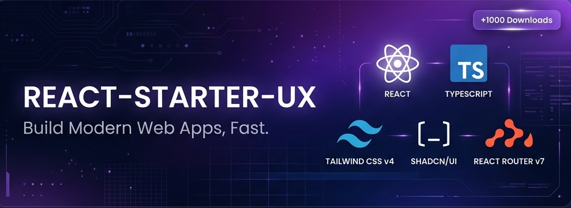

# React Starter Kit

A professional scaffolding CLI and monorepo structure designed to create high-performance, secure, and modern React client-side applications.



## Overview

React Starter Kit is a production-ready scaffolding framework for bootstrap workflows. It features pre-configured authentication, routing security, client-side input validation, and light/dark theme support.

The CLI package `@nosleepman/react-starter` has achieved over 1000 downloads on npm, demonstrating its stability and convenience.

## Quick Start

Create a new application instantly using the CLI tool:

```bash
npx @nosleepman/react-starter my-app
```

The CLI will prompt you for the project name and package manager (npm, yarn, pnpm, or bun), download the template, configure environment variables, and optionally install dependencies.

## Documentation Index

Detailed documentation is available in both English and French inside the organized docs folder.

### English (EN)

- [Read Me - Full English Version](docs/README.en.md)
- [Technical Architecture and Design Patterns](docs/ARCHITECTURE.md)
- [Contributing Guidelines and Standards](docs/CONTRIBUTING.md)
- [Testing Guidelines](docs/TESTING.md)

### Français (FR)

- [Lisez-moi - Version Française Complète](docs/README.fr.md)
- [Architecture Technique et Choix Technologiques](docs/ARCHITECTURE.fr.md)
- [Directives et Règles de Contribution](docs/CONTRIBUTING.fr.md)
- [Guide de Test (Français)](docs/TESTING.md)

## Repository Structure

The project follows a clean monorepo architecture:

- **cli/**: Code for the lightweight npm scaffolding CLI tool.
- **template/**: The core React application template containing components, routes, types, and styles.
- **docs/**: All project documentation guides.

## License

This project is licensed under the MIT License - see the LICENSE file for details.
